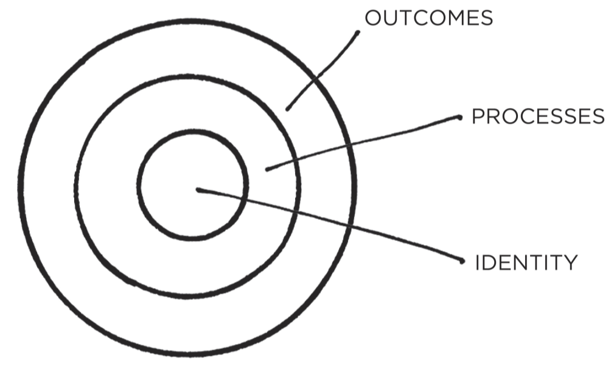

 - People focus in order on
   - Outcomes: I want to be 20 pounds skinner
   - Process: How do I become 20 pounds skinners
   - Identity: I won't look good until I'm 20 pounds skinner
 - Focusing on outcomes first is detrimental because you will view yourself negatively until you reach that outcome
   - No happiness unless outcome occurs
   - If you fail it will compound negatively
   - Even if you succeed you may create a new outcome that limits your happiness again
 - You need to first change your identity

### Two step process to changing identity
- Every action is like a vote for the type of person you want to become
- Process
  - Decide who you want to be
    - Great at health, golfing, basketball, coding, entrepreneurship, speaking, listening  
      - Who could achieve all of this? The author of this book
      - What would this person do?
        - Would a healthy person uber or walk to the train?
        - Would a someone who wants to be better at both basketball and golf focus on their strength or core and endurance when working out
        - Would a coder give up on this leetcode problem or try to figure out the solution
  - Prove it to yourself with small wins
    - Every small step, taking the train instead of ubering for example, reinforces the mindset that you are that person you want to be. 
    - Different outcomes can relate to each other.
      - Being healthy can start with better sleep schedule which in turn improves fitness levels for sports and mental level for coding and speaking and listening
  ### Chapter Summary 
  - 3 levels of change: outcome, process, identity
  - Focus on the identity
  - Build identity with atomic habits
  - Outcomes are lifelong and dynamic. You will always have to update your beliefs and expand yourself further. 
